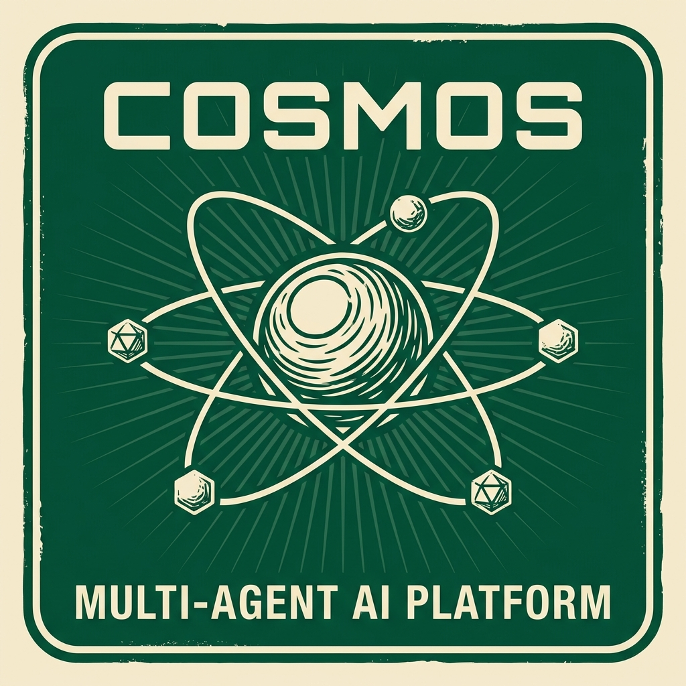

# COSMOS: Clinical Oncology Scalable Multi-agent Orchestration System



*An efficient, visual multi-agent orchestration platform for clinical oncology and precision medicine.*

**COSMOS** is a state-of-the-art **visual multi-agent orchestration platform** designed to streamline the construction, configuration, and execution of complex AI agent networks. Built with a focus on clinical oncology but adaptable to any domain, COSMOS empowers researchers to model intricate decision-making processes using a flexible graph-based interface.

Backed by a high-performance **Python/FastAPI backend**, it supports asynchronous agent execution, batch processing, and seamless integration with the broader Python AI ecosystem.

**Want to start now?** [Jump to Installation](#installation) or [walk through our Getting Started guide](#getting-started).

---

## **Why choose COSMOS?**

* 🚀 **Scalable & Visual**: Design complex workflows using an intuitive graph-based editor (Vue Flow) and execute them via a robust async backend.  
* 🧠 **Agentic Intelligence**: Configure agents with specific presets (Analytical, Creative) and built-in "Rogue Modes" (Hallucination, Omission) to stress-test your network's robustness.  
* 📦 **Reproducible**: Save complete experimental setups (including global settings like Temperature/Model) as templates; persistent `.output` files ensure a clean audit trail.
* 🔬 **Clinical Focus**: Specialized for **Tumor Board Simulation** and biomarker discovery pipelines, bridging the gap between clinical expertise and AI orchestration.  
* ⚡ **Batch Processing**: Run validations across entire folders of patient cases simultaneously with drag-and-drop ease.  
* 🔗 **Modern Stack**: Built on **Vue 3 + TypeScript** for a reactive UI and **FastAPI + Pydantic** for a type-safe, high-performance backend.  

## **Real-World Examples of COSMOS in Action**

- **Precision Oncology Tumor Board:** Simulates a multidisciplinary team (Oncologist, Pathologist, Radiologist) debating treatment options for complex patient cases. COSMOS manages the "Informs", "Critiques", and "Decides" relationships to synthesize a consensus recommendation.

- **Clinical Oncology Pipelines:** Orchestrates multi-step decision workflows where agents formulate hypotheses, retrieve literature (RAG), and critique treatment plans in a loop.

## **Technology Stack**

| Component | Technology | Description |
|-----------|------------|-------------|
| **Frontend** | **Vue 3** | Reactive, component-based UI framework. |
| | **TypeScript** | Ensures type safety and code reliability. |
| | **Vue Flow** | Powerful library for interactive graph visualization. |
| **Backend** | **Python 3.11+** | Core runtime environment. |
| | **FastAPI** | Modern, high-performance async web framework. |
| | **OpenAI SDK** | Standardized interface for LLM calls (supports OpenAI, LocalAI, vLLM). |

## Installation

### Prerequisites
- **Python** 3.11+
- **Node.js** 18+ & **npm** 9+
- **OpenAI API Key** (or compatible local endpoint)

### 1. Clone the Repository

```bash
git clone https://github.com/KatherLab/agentdashboardpy.git
cd agentdashboardpy
```

### 2. Backend Setup

```bash
python -m venv venv
# Windows
venv\Scripts\activate
# Mac/Linux
source venv/bin/activate

pip install -r server/requirements.txt
```

### 3. Frontend Setup

```bash
cd client
npm install
cd ..
```

## Basic Usage

To run COSMOS, you will need two terminal windows open.

**Terminal 1: Backend**
```bash
# Ensure venv is active
uvicorn server.main:app --reload --port 8000
# Swagger UI available at http://localhost:8000/docs
```

**Terminal 2: Frontend**
```bash
cd client
npm run dev
# Dashboard accessible at http://localhost:5173
```

## Reference

If you find our work useful in your research, please consider citing:

```
@Misc{COSMOS2026,
  author={Wu, Xuewei and Kather, Jakob Nikolas},
  title={COSMOS: Clinical Oncology Scalable Multi-agent Orchestration System},
  year={2026},
  publisher={Kather Lab},
  url={https://github.com/KatherLab/agentdashboardpy}
}
```

## License

MIT License - see [LICENSE](LICENSE) for details.

Copyright (c) 2026 Xuewei Wu, Jakob Nikolas Kather (Kather Lab)
